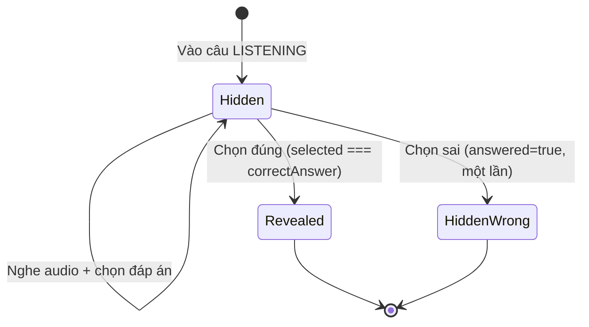

# LISTENING Quiz — Reveal UX (QuizPage)

Tài liệu mô tả thay đổi frontend cho câu hỏi **LISTENING** trong `QuizPage.tsx`.

| Mục | Giá trị |
|-----|---------|
| File | `FE_SP26SE049/src/modules/learner/pages/QuizPage.tsx` |
| Ngày cập nhật | 2026-06-02 |
| Phạm vi | Chỉ UI learner — không đổi API/backend |

---

## 1. Vấn đề trước khi sửa

- `challenge_bank.content_text` được map vào `ch.content` và hiển thị trong `<h4>` → **lộ đáp án** (vd. `giỗ`) trước khi nghe.
- Nhãn "Nghe và chọn..." không hiện vì code so sánh `ch.mode === 'LISTENING'` trong khi LISTENING thực tế dùng `mode = 'MULTIPLE_CHOICE'`.
- Seed DB thường chỉ có **2** phần tử trong `metadata_json.options` → UI chỉ 2 nút (cần bổ sung đáp án qua Admin/SQL — xem hướng dẫn riêng).

---

## 2. UX mục tiêu



| Trạng thái | Hiển thị tiêu đề |
|------------|------------------|
| Ban đầu | `Đáp án đúng: ......` (màu xám) |
| Chọn **đúng** | `Đáp án đúng: giỗ` (màu xanh lá) |
| Chọn **sai** | Vẫn `......` (logic hiện tại: `answered = true`, không chọn lại) |

**Điều kiện nhận diện LISTENING:** `ch.skillType === 'LISTENING'` (không dùng `ch.mode`).

---

## 3. State & biến derived

Thêm ngay sau `const ch = challenges[idx]` (~dòng 1221):

```tsx
const ch = challenges[idx]
const isListeningQuestion = ch?.skillType === 'LISTENING'
/** LISTENING: reveal target word only after the user picks the correct option */
const listeningRevealedWord =
  isListeningQuestion && answered && selected === ch?.correctAnswer
    ? (selected || ch.correctAnswer)
    : null
```

| Biến | Ý nghĩa |
|------|---------|
| `isListeningQuestion` | Câu hiện tại là LISTENING |
| `listeningRevealedWord` | Từ reveal; `null` nếu chưa chọn đúng |
| `selected` | Đáp án user vừa chọn (state có sẵn) |
| `answered` | Đã chốt một lần trả lời (state có sẵn) |
| `ch.correctAnswer` | Đáp án đúng từ `metadata_json` |

---

## 4. Thay đổi 1 — `MCOptions` (lưới 4 đáp án)

**Vị trí:** ~dòng 271–315

**Trước:** `grid grid-cols-2 gap-4`

**Sau:** Responsive 1 cột mobile / 2 cột từ `sm`, căn giữa, tối đa 4 ô theo `options.length` từ API.

```tsx
/** Multiple choice (READING v1, LISTENING, ENTRY_TEST) — 2×2 grid for up to 4 options */
function MCOptions({ options, correct, answered, selected, onSelect }: {
  options: string[]; correct: string; answered: boolean; selected: string | null; onSelect: (o: string) => void
}) {
  return (
    <div className="grid grid-cols-1 sm:grid-cols-2 gap-4 w-full max-w-3xl mx-auto">
      {options.map((opt, i) => {
        const isRight = answered && opt === correct
        const isWrong = answered && opt === selected && opt !== correct
        const isSelected = selected === opt && !answered

        return (
          <motion.button
            key={i}
            whileHover={answered ? {} : { y: -2 }}
            whileTap={{ scale: answered ? 1 : 0.98 }}
            onClick={() => onSelect(opt)}
            className={clsx(
              'w-full text-left px-6 py-4 rounded-3xl border-[3.5px] font-black text-lg transition-all duration-200 min-h-[100px] flex items-center',
              isRight ? 'border-emerald-500 bg-[#E8F5E9] text-emerald-700 shadow-[4px_4px_0_#10B981]'
                : isWrong ? 'border-rose-500 bg-[#FCE8E8] text-rose-600 shadow-[4px_4px_0_#F43F5E]'
                  : isSelected ? 'border-[#49B6E5] bg-[#E1F5FE] text-slate-800 shadow-[6px_6px_0_#1f2937] -translate-y-1'
                    : 'border-slate-900 bg-white text-slate-700 hover:border-[#49B6E5] hover:bg-slate-50 shadow-[4px_4px_0_#1f2937]'
            )}
          >
            <div className="flex items-center gap-4 w-full">
              <div className={clsx(
                "w-10 h-10 rounded-full border-[2.5px] flex items-center justify-center shrink-0 text-xl",
                isRight ? "bg-emerald-500 border-emerald-600 text-white"
                  : isWrong ? "bg-rose-500 border-rose-600 text-white"
                    : isSelected ? "bg-[#49B6E5] border-slate-900 text-white"
                      : "bg-white border-slate-900 text-slate-900"
              )}>
                {isRight ? <CheckCircle size={18} strokeWidth={3} />
                  : isWrong ? <XCircle size={18} strokeWidth={3} />
                    : <span>{String.fromCharCode(65 + i)}</span>}
              </div>
              <span className="flex-1 leading-tight">{opt}</span>
            </div>
          </motion.button>
        )
      })}
    </div>
  )
}
```

Logic chọn đáp án (không đổi) — nhánh `MULTIPLE_CHOICE` trong `renderInteraction()`:

```tsx
const handleSelect = (opt: string) => {
  if (answered) return
  if ((ch.audioUrl || ch.transcript) && (audioPlays[idx] || 0) === 0) {
    message.warning('Bạn cần nghe âm thanh trước khi chọn đáp án!')
    return
  }
  setSelected(opt); setAnswered(true)
  const isCorrect = opt === ch.correctAnswer
  if (isCorrect) setScore(s => s + 1)
  explainAnswer(ch, opt, isCorrect)
}
```

---

## 5. Thay đổi 2 — Nhãn & `<h4>` (ẩn / reveal)

**Vị trí:** ~dòng 1665–1694

### Nhãn phụ (instruction line)

```tsx
<p className="text-base font-black uppercase tracking-[0.15em] text-slate-700">
  {ch.mode === 'SPEAKING_READ' ? 'Hãy phát âm từ / câu sau:'
    : isListeningQuestion ? 'Nghe và chọn đáp án đúng:'
    : ch.mode === 'MULTIPLE_CHOICE' ? 'Chọn đáp án đúng:'
    : 'Câu hỏi:'}
</p>
```

### Tiêu đề chính — LISTENING dùng placeholder

```tsx
{ch.mode !== 'WRITING_FILL' && (
  <h4 className="text-4xl font-black text-slate-900 leading-snug max-w-2xl">
    {isListeningQuestion ? (
      <span>
        Đáp án đúng:{' '}
        <span className={listeningRevealedWord ? 'text-emerald-600' : 'text-slate-400 tracking-widest'}>
          {listeningRevealedWord ?? '......'}
        </span>
      </span>
    ) : (
      ch.content
    )}
  </h4>
)}
```

| Skill | Hiển thị `<h4>` |
|-------|----------------|
| LISTENING | `Đáp án đúng: ......` → reveal khi chọn đúng |
| Khác (READING MC, SPEAKING, …) | `ch.content` như cũ |

---

## 6. Thay đổi 3 — Nút "Xem mô hình phát âm"

**Vị trí:** ~dòng 1696–1704

Tránh mở popup với `ch.content` (có thể chứa đáp án) khi LISTENING chưa reveal.

**Trước:**

```tsx
{answered && (
  <button onClick={() => { setPronWord(ch.content); setShowPronModel(true); }}>
```

**Sau:**

```tsx
{answered && (!isListeningQuestion || listeningRevealedWord) && (
  <button
    onClick={() => { setPronWord(listeningRevealedWord || ch.content); setShowPronModel(true); }}
```

---

## 7. Dữ liệu backend liên quan

`parseChallenge()` map LISTENING → `mode: 'MULTIPLE_CHOICE'`:

```ts
// metadata_json (challenge_bank)
{
  options: string[]        // nên có 4 phần tử
  correctAnswer: string
  transcript?: string      // TTS khi không có audioUrl
  audioUrl?: string
}
```

| Field | Hiển thị trên UI LISTENING |
|-------|---------------------------|
| `contentText` → `ch.content` | **Không** dùng trong `<h4>` nữa |
| `correctAnswer` | Chấm điểm + reveal |
| `transcript` | Chỉ dùng phát audio (ẩn) |
| `options` | `MCOptions` |

---

## 8. Kiểm tra thủ công

1. Mở quiz có câu `skillType: LISTENING`.
2. Xác nhận: không thấy từ đáp án trong `<h4>`, chỉ `Đáp án đúng: ......`.
3. Nghe audio → chọn đúng → từ hiện màu xanh + nút mô hình phát âm.
4. Chơi lại câu khác, chọn sai → vẫn `......`, không retry (đúng logic cũ).
5. Network: `metadataJson.options.length === 4` nếu đã cập nhật DB.

---

## 9. Việc chưa làm (out of scope)

- Mode BASIC / ADVANCED listening (JSON `listeningMode`).
- Migration seed tự động 4 đáp án toàn hệ thống.
- Cho phép chọn lại sau khi sai.
- Ẩn `transcript` trên UI (đã ẩn qua việc không render `ch.content`).

---

## 10. Diff tóm tắt

| # | Khu vực | Thay đổi |
|---|---------|----------|
| 1 | `MCOptions` | Grid responsive 2×2, `max-w-3xl` |
| 2 | Sau `const ch` | `isListeningQuestion`, `listeningRevealedWord` |
| 3 | Instruction | `isListeningQuestion` thay `mode === 'LISTENING'` |
| 4 | `<h4>` | Placeholder `......` + reveal |
| 5 | Pronunciation popup | Chỉ khi reveal (LISTENING) |
